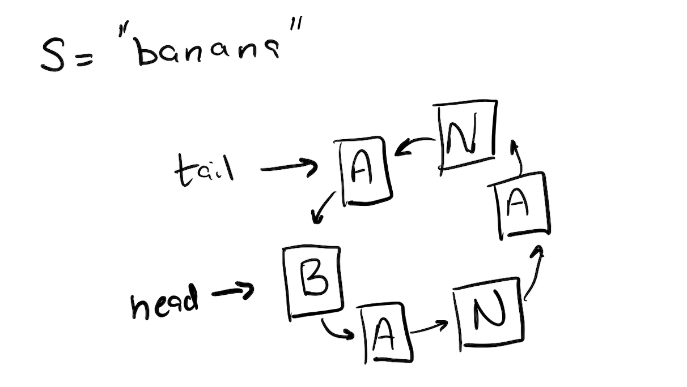
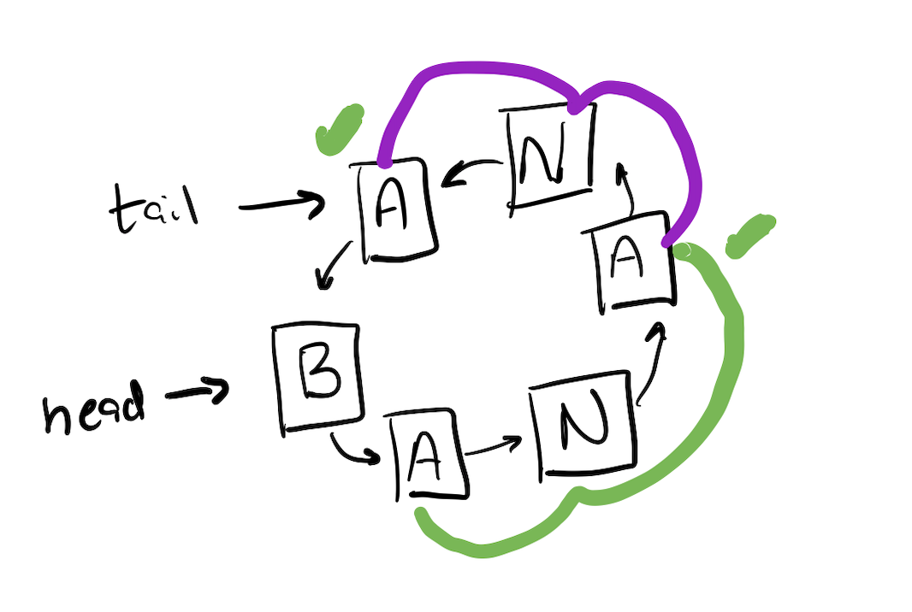
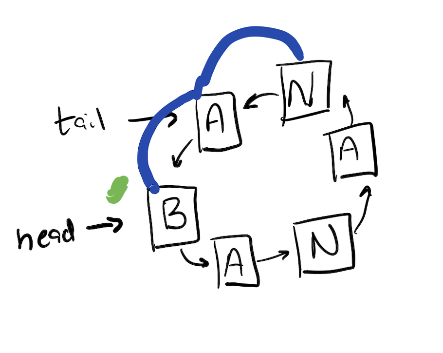
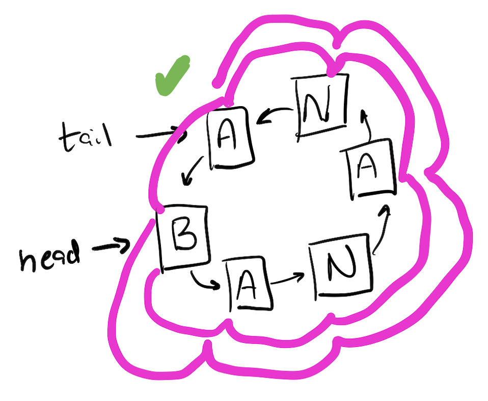
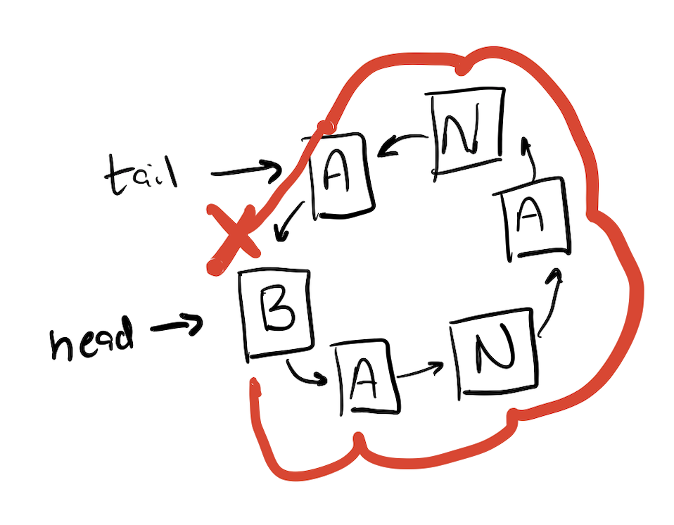

# Week 9
Many species of portions of thier genetic information that is [cyclic](https://en.wikipedia.org/wiki/Circular_DNA), 
that is the sequence has no start or end position. 
When we want to search for sequences within that genetic information, 
we must search all starting positions. 
We often do write the sequence down so it can be stored more easily, but when loading it into a piece of software we must "circularize" it. 

In this week's lab activity you will use a circular linked list to hold a circular genome, 
and you will then search for strings within that circular sequence. 

Each node of the linked list will hold a single character.
Here is an example of what your linked list will look like for the string "banana". 
Note that eventhough the input is in lower case, the string is stored in all caps. 
Often we want to ignore the case when searching genomic information. 

When searching we want to account for a string occuring multiple times. 
In this example, we are looking for "ANA", it can be found at positions 2 and 4. (note that this is 1 index) 
In this case the string returned by the search method is "'ANA' found at position(s) 2, 4". 

Because the string is circular occurances can cross the boundry between the head and the tail nodes. 
In the following example we are searching for "nab" (or "NAB"). 
The string returned by the search method will be "'NAB' found at position(s) 5". 

Similarly, because the search can continue across the boundry, 
we could search for something that is longer. 
In this example we're searching for "bananabanana". 
The search mehod would return the following "'BANANABANANA' found at position(s) 1". 

In the following example, we don't find the string "Bananas" (note the s). 
The we would search all start positions, on the first position we get farthest before we find a mismatch. 
Below is an example of how the recursive matching procedure would progress as it searches, 
when it gets back to compare 'S' and 'B' a mismatch is found so the recursive match returns false (as do all of the other start positions). 
In this case the search method returns the string "'BANANAS' not found".

The last example shows how you will progress with your search. 
Your search method within the circular linked list class will begin a match at each start position, 
the match will be performed recursively by each of the individual nodes. 
If any locations return "True" then the search will return a string with all of the locations that are true, 
if they all return "False" it will return a string that says so. 

## Your Tasks
You will complete the `CircularGenome` class that includes the (non-recrusive) `search` method, 
as well as the constructors needed to convert the linear input string into a circular structure. 
You will also need to complete the `Nucleotide` class (this is your linked list node) which will contain a constructor as well as 
the recursive `match` method. 

### `CircularGenome`
This class will contain a pointer to two `Nucleotide` objects: `head` and `tail`.
No other class variables should be defined. 
The linked list will be circular meaning it will always be true (once constructed) that `tail.next == head`. 

#### Constructor
The only constructor will take as input a single String. 
It will first confirm (or transform) the string is all uppercase letters. 
It will then build the circular linked list by creating nodes from the single characters in the list. 

#### `public String toString()`
This method will define a method that reconstructs the un-circularized genome by traversing the linked list and returns it. 

#### `public String search(String)`
This method takes as input a search String, and returns a string either containing the locations or that no matches are found. 
The formatting for these strings is shown in the examples above. 

To accomplish this, this method will call `.match(String)` with the input string (converted so that the search ignores the case) 
on each starting position in the genome (each node in the linked list). 
Each call will return a boolean which will be used to construct the return string. 

### `Nucleotide`
Each instance of `Nucleotide` will contain a single *private* `char` and a `next` pointer to another instance of `Nucleotide`. 

#### Constructor
The constructor will take in a single `char` and assign it to the stored value. 

#### `public char getChar()`
Returns the character stored at this node (it is private so it can't be accessed in other contexts).

#### `public boolean match(String)`
This *recursive* method will return true when the given string starts at this node. 
It will do this by: 
1. checking if the first character of the input matches this instances' `char`, and 
1. checking if all but the first character matches the genome stating at the `next` node. 

If both of these is satisfied, return `True` otherwise return `False`. 

### `Tester`

In this method you will provide at least 10 unit tests with descriptions confirming that the implementations of the two classes defined are correct. 

## Grading 
160 points
`CircularGenome` 80 pts.
* constructor 20 pts.
* `toString` 20 pts. 
* `search` 40 pts. 
`Nucleotide` 60 pts. 
* constuctor 10 pts. 
* `getChar` 10 pts. 
* `match` 40 pts. 
`tester` 20 pts. (2 points each unit test)
